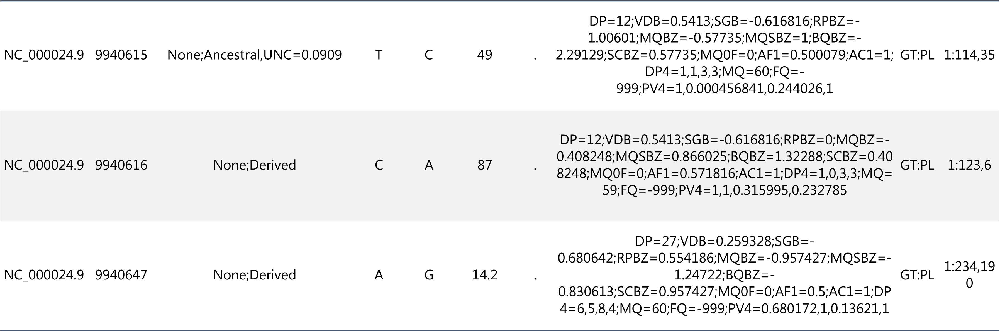
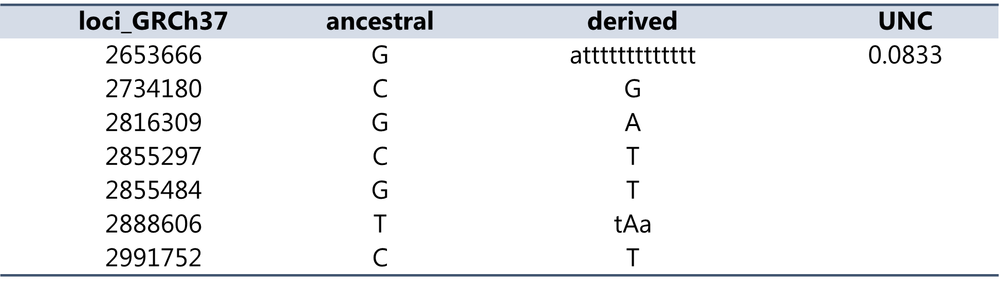
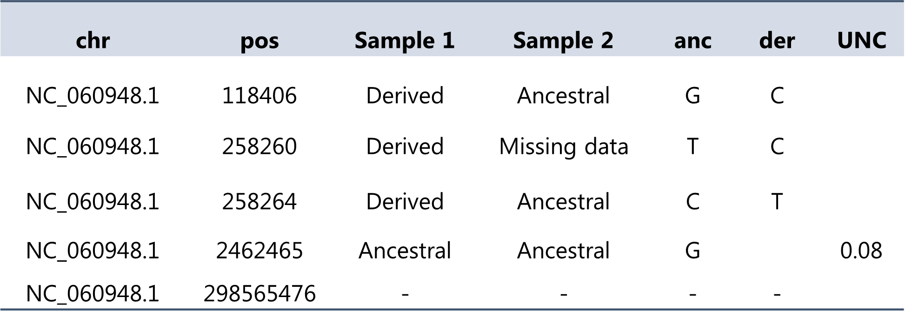

## POLARYZER
Accesses the Y-ARS to identify the polarization of alleles (i.e. , ancestral versus derived alleles) of variants reported in vcf files.


### 1) Installation
Operating system: Linux

Type in the shell:
```
git clone https://github.com/ZehraKoksal/Y-ARS.git
cd Y-ARS/Polaryzer/
python polarYzer.py -h
```
<br><br>


### 2) Requirements and Commands
Polaryzer is written using python and requires a small set of packages that can be installed in a new virtual environment. 
Make sure to use a newer version of python to avoid problems with the package pyarrow. We recommend python 3.11.11.

In a (linux) command line you can run the following commands:
```
python3.11 -m venv Y_is_fun
source Y_is_fun/bin/activate
pip install numpy
pip install cyvcf2
pip install pandas
pip install pysam
pip install pyarrow
```
The following versions of the packages are used:
numpy v2.2.4, cyvcf2 v0.31.1, pandas v2.2.3, pysam v0.23.0, pyarrow v19.0.1

Now the environment is prepared to run polaryzer!


<br><br>
### 3) Run polaryzer
Polaryzer can be applied to single sample vcf files and multisample vcf files. The first results in an annotated vcf file with the polarization (ancestral/derived) in the ID column. For the latter, a tab-separated .csv file is generated with samples in columns and loci in rows.

It is important that vcf files have correct headers to be recognized as vcf files by polaryzer!

<br><br>
#### a) Single sample vcf input file
When running polaryzer on single sample vcf files, the user needs to specify the exact name of the Y chromosome used in the CHR column of the vcf file using parameter **-chromosome**, defining the reference sequence for alignment/in SNP array among GRCh37, GRCh38 or T2T following **-reference**. Define the path to a single vcf file OR the folder containing several vcf files following parameter **-input_single_vcf**. 


```
python polarYzer.py -chromosome NC_060948.1 -reference T2T -input_single_vcf vcf_T2T_test/
```

The resulting vcf files (named "_polarized.vcf") will be annotated in the ID column (third column of vcf file). As visible below, previous annotations in the ID column will be supplemented with the allelic state of the allele in the sample, followed by the uncertainty score (UNC) representing the reliability of the reconstructed ancestral allele and therefore the annotated allele polarization. A score close to 0 indicates a higher reliability, while a score close to 1 indicates lower reliability due to high mutability or high missingness at this site. Sites without an UNC score likely have a high reliability. They simply do not contain a score, because these sites had not been part of the ancestral state reconstruction, as they were not polymorphic among the major haplogroups during our ancestral state reconstruction. More details on the UNC score can be obtained from our publication (see section 5).




<br><br>
Optionally, the parameter **-output_loci_dict** can be added to obtain a tab-separated csv file containing all loci and the ancestral and derived allele information over all vcf files.
```
python polarYzer.py -chromosome NC_060948.1 -reference T2T -input_single_vcf vcf_T2T_test/ -output_loci_dict
```

The resulting .csv file contains the different loci in different rows. The columns represent the ancestral alleles, all derived alleles found in the vcf files, and the UNC score in the last column (see above for more details or section 5).




<br><br>
The modified vcf files will by default be stored in the same folder as the input files, and the -output_loci_dict output file in the same folder as the polaryzer.py python script is stored. The user can customize the folder where both of the output files are stored by defining the path to the output folder following **-output**. If the output folder does not exist already, it will be automatically created.

```
python polarYzer.py -chromosome NC_060948.1 -reference T2T -input_single_vcf vcf_T2T_test/ -output_loci_dict -output ./output
```


The single sample vcf file mode is run in parallel mode to reduce computing time.

<br><br>
#### b) Multi sample vcf input file
When running polaryzer on **one** multiple sample vcf file, the user needs to specify the exact name of the Y chromosome used in the CHR column of the vcf file using parameter **-chromosome**, defining the reference sequence for alignment/in SNP array among GRCh37, GRCh38 or T2T following **-reference**. Define the path to the vcf file following parameter **-multiple_sample_vcf**.
```
python polarYzer.py -chromosome NC_060948.1 -reference T2T -multi_sample_vcf multisample_vcf_t2t.vcf
```

The resulting output table presents the different loci in different rows (see image below). The columns present different samples, followed by the ancestral and derived allele. The last column (UNC) contains the uncertainty score for sites that were part of the ancestral state reconstruction. A score close to 0 indicates a higher reliability, while a score close to 1 indicates lower reliability due to high mutability or high missingness at this site. In the output table, sites that do not contain an uncertainty score did not show to be polymorphic among the major haplogroups during our ancestral state reconstruction and thus likely have a high reliability. The resulting output table is saved as .csv file.



The output file will by default be stored in the same folder as the input vcf file. The user can customize the output folder by defining the path to the output folder following **-output**. If the output folder does not exist already, it will be automatically created.
<br><br>
#### c) Example files

Different test vcf files from the 1000 Genomes Project for inputs in the **single sample vcf file mode** of the three reference genomes are available in the [subfolder example_vcfs](https://github.com/ZehraKoksal/Y-ARS/tree/main/Polaryzer/example_vcfs)


<br><br>
### 4) Additional Information and Contact
More information on the software are available in [our publication:](https://academic.oup.com/mbe/advance-article/doi/10.1093/molbev/msaf222/8252812?searchresult=1)

For reporting bugs, comments or questions, you are welcome to contact zehra.koksal@liu.se


<br><br>
### 5) Referencing

Please cite: Zehra Köksal, Annina Preussner, Jaakko Leinonen, Taru Tukiainen, Introducing the Y-chromosomal ancestral-like reference sequence - Improving the capture of human evolutionary information, Molecular Biology and Evolution, 2025;, msaf222, https://doi.org/10.1093/molbev/msaf222


